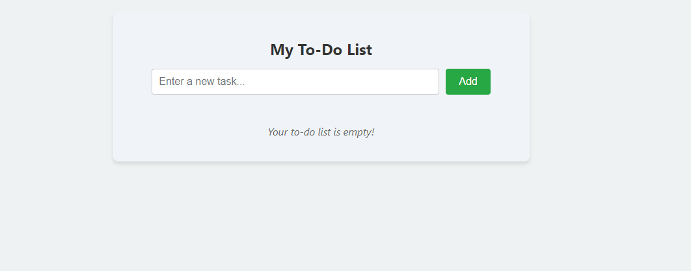
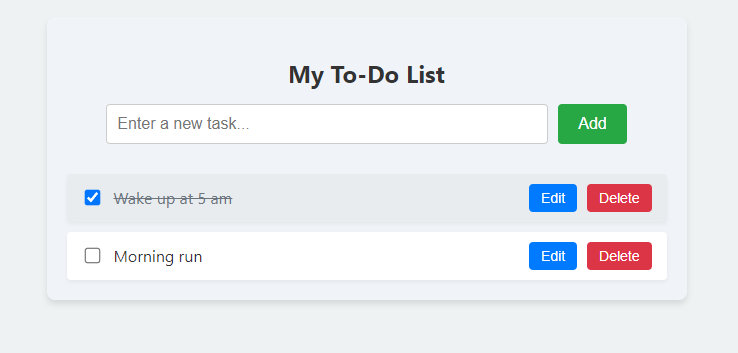

 **React To-Do List** application built with **Vite**.

---

# To-Do App



## Table of Contents

1. [Introduction](#introduction)
2. [Features](#features)
3. [Technologies Used](#technologies-used)
4. [Installation](#installation)
5. [Usage](#usage)
6. [License](#license)
7. [Contact](#contact)
8. [Screenshots](#screenshots)


---

## Introduction

Welcome to the **To-Do App**! This application is a simple yet powerful tool to help you manage your daily tasks efficiently. Built with **React** and **Vite**, it offers a seamless and fast user experience with features that allow you to add, edit, complete, and delete tasks with ease. Additionally, your tasks are persisted using the browser's Local Storage, ensuring that your to-do list remains intact even after refreshing the page.

---

## Features

- **Add Tasks:** Quickly add new tasks to your to-do list.
- **Edit Tasks:** Modify existing tasks to keep your list up-to-date.
- **Complete Tasks:** Mark tasks as completed to track your progress.
- **Delete Tasks:** Remove tasks that are no longer needed.
- **Persistent Storage:** Tasks are saved in Local Storage, ensuring data persistence across sessions.
- **Responsive Design:** Optimized for various screen sizes, ensuring usability on both desktop and mobile devices.

---

## Technologies Used

- **React:** A JavaScript library for building user interfaces.
- **Vite:** A fast build tool that provides a smoother development experience.
- **ESLint:** A tool for identifying and reporting on patterns in JavaScript.
- **CSS:** Styling the application with responsive design principles.

---

## Installation

Follow these steps to set up the project locally:

### Prerequisites

- **Node.js** (v14 or higher): [Download Node.js](https://nodejs.org/)
- **npm** (comes bundled with Node.js)
- **Git**: [Download Git](https://git-scm.com/)

### Steps

1. **Clone the Repository**

   ```bash
   git clone https://github.com/NarayananM264059/To_Do_App.git
   ```


2. **Navigate to the Project Directory**

   ```bash
   cd To_Do_App
   ```

3. **Install Dependencies**

   ```bash
   npm install
   ```

4. **Start the Development Server**

   ```bash
   npm run dev
   ```


---

## Usage

Once the development server is running, you can interact with the To-Do List application as follows:

1. **Add a New Task**
   - Enter the task description in the input field.
   - Click the "Add" button or press Enter to add the task to the list.

2. **Mark Task as Completed**
   - Click the checkbox next to a task to mark it as completed.
   - Completed tasks will have a strikethrough effect.

3. **Edit a Task**
   - Click the "Edit" button next to the task you want to modify.
   - Update the task text in the input field that appears.
   - Click "Save" to apply the changes.

4. **Delete a Task**
   - Click the "Delete" button next to the task you wish to remove from the list.

5. **Persistent Storage**
   - Your tasks are saved in the browser's Local Storage.
   - Refreshing the page will retain your current to-do list.

---

## License

This project is licensed under the [MIT License](./LICENSE).

---

## Contact

For any questions or suggestions, feel free to reach out:

- **Email:** narayananmannazhi10@gmail.com
- **GitHub:** [NarayananM264059](https://github.com/NarayananM264059)

---

# Screenshots




